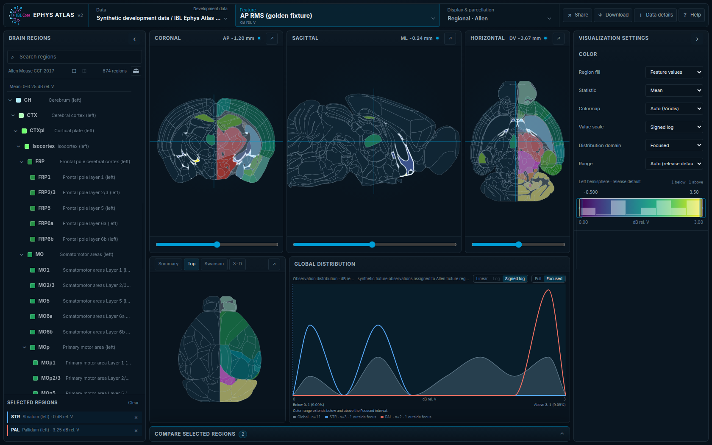
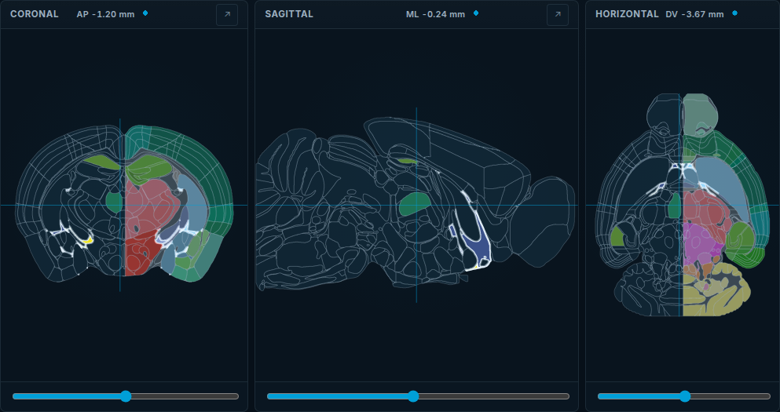
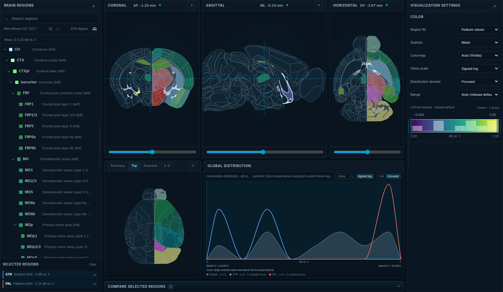

# Use the viewer

Status: reader guide; release metadata and the launch specification remain
authoritative for scientific meaning and implemented behavior.

The IBL Ephys Atlas places regional summaries and scalar volumes in a shared
mouse-brain anatomical workspace. Start with **Help** in the application for a
four-step Quick Start or choose **Show me the essentials** for a short guided
walkthrough of the visible controls.

*Synthetic demonstration data. The full desktop workspace provides orientation; the focused images below keep individual controls legible.*

## Choose what to explore

Use **Data** to choose a dataset and **Feature** to choose what to explore.
**Display & parcellation** above the views controls its representation.
Development, legacy, and browser-local status remain visible beside Data.
Published choices come from the public catalog and selected release rather
than a fixed frontend list. Imported releases appear separately under the
Local dataset identity.

- A **dataset** identifies a scientific product.
- A **release** is an immutable snapshot of that product. Changing it may
  change the features, values, source population, or scientific recipe.
- A **feature** is the measured or derived quantity being displayed. Open
  **Data details** to check its unit, source, population, and provenance.
- **Regional** displays release-provided summaries for atlas regions.
- **Volume** displays values sampled on the feature's declared voxel grid.

Use `/` to search the feature catalog. `Shift` + `Arrow down` and `Shift` +
`Arrow up` move to the next or previous feature without wrapping at the ends.

## Navigate the anatomical workspace

Coronal, sagittal, and horizontal views share one ML/AP/DV world cursor. Move
through the brain with a slice control, the arrow keys while a control is
focused, or the mouse wheel over a registered view. Moving one plane updates
the linked guides in the other two.

*Synthetic demonstration data. All three views share one ML/AP/DV cursor.*

Top and Swanson occupy the secondary workspace as static regional projections.
They share regional coloring, hover, selection, and focus, but they are not
slices and do not provide voxel or world-coordinate navigation. The optional
3-D anatomy view is also contextual: scalar volume features remain linked 2-D
slices.

Use a view's maximize action when you need more space. `Escape` restores the
workspace. On desktop, the Regions and Settings panes can be collapsed with
`[` and `]`; on smaller screens the same content appears in drawers.

## Inspect regional data

Hover over a brain region to inspect its name and current value. Select a
region from a brain view or the Regions pane to add it to the shared
comparison. Selection is synchronized across the regional views and preserved
in the share URL.

The selected statistic determines which release-provided summary is shown.
Missing values remain missing rather than being interpreted as zero. The
global distribution describes the complete release population; the selected
comparison shows descriptive statistics and distributions for chosen regions.

Changing the parcellation changes the region identities and summaries being
displayed. See [Understand parcellations](parcellations.md) before comparing
results across Allen, Beryl, and Cosmos.

## Inspect volume data

Hover over a registered view to inspect the nearest voxel at that atlas
location. The viewer reports valid, missing, outside, and out-of-grid locations
explicitly; none of those categories is silently converted to scientific zero.

The anatomical overlay helps identify the surrounding region. Changing its
parcellation does not resample, aggregate, or otherwise alter the volume grid
or source voxel values. Volume distributions describe valid voxels globally.

Settings can adjust volume opacity and anatomy outlines. Those presentation
controls do not change voxel inspection, statistics, or downloads.

## Interpret the display

The colormap, scale, distribution domain, and color range control how values
are presented. They do not modify the underlying observations or downloaded
values.

- **Linear** preserves equal numeric intervals.
- **Log**, when declared by the release, is available for strictly positive
  populations.
- **Signed-log** can show signed, heavy-tailed values around zero.
- **Full** shows the complete declared distribution domain.
- **Focused** enlarges a reviewed interval while disclosing values below and
  above it.

*Synthetic demonstration data. Presentation controls affect the display, not the underlying observations.*

Open **Data details** before interpreting or citing a feature. It records the active
dataset and exact version, feature semantics, source population, and provenance.
If other versions are available, **Change version…** lets you select one directly.
Otherwise it shows **Only available version**. Changing versions may change the
available features and scientific population. A named snapshot return restores
its prescribed versions when switching datasets; **Use default version** changes
only the current dataset. Share links retain exact version identities.

## Share and download

**Share** copies a URL containing the current scientific and workspace state,
including dataset/release identity, feature, representation, parcellation,
cursor, display choices, and regional selection where relevant.

**Download** provides immutable release artifacts and contextual exports for
the active feature. Exports preserve the dataset, release, feature,
representation, and applicable statistic or parcellation identity.

## Import your own data

The supported custom-data workflow creates a validated
`.ibl-ephys-atlas.zip`, previews it in the browser, and stores its declared
resources in browser-local IndexedDB only after confirmation. The archive is
not uploaded.

Start with [Author and import data](index.md) or follow the
[custom-data tutorial](../data/CUSTOM_DATA_TUTORIAL.md). A shared URL does not
contain local data; another browser must import the same immutable release
before that URL can resolve it.

## Keyboard reference

- `?` — open Help
- `/` — search features
- `Shift` + `Arrow down` / `Shift` + `Arrow up` — next / previous feature
- `[` / `]` — toggle the Regions / Settings pane
- Arrow keys — adjust a focused slice or control
- `Escape` — close transient UI or restore a maximized view

Every important action is also available through a visible control.
